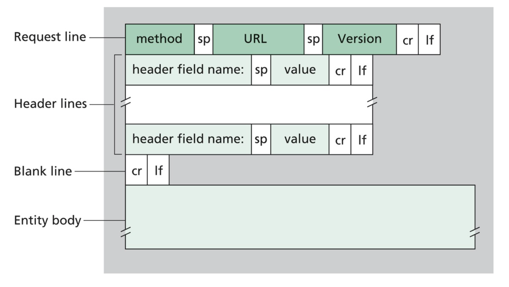

# Lab 1: Simple HTTP Server

In this lab, you will build on your understanding of processes as programs executing in memory and explore how applications interact with the operating system kernel. You will study the mechanisms the OS provides for process management, interprocess communication, and controlled access to system resources. The goal is to connect core operating system concepts to practical, user-level programs.

You will work with the following concepts:
* <ins>Process control</ins>: Creating, managing, and terminating processes.
* <ins>Signals</ins>: Handling asynchronous events generated by the kernel or other processes.
* <ins>System calls</ins>: Using kernel interfaces to request services such as process management.
* <ins>Process communication</ins>: Use network sockets to enable interprocess communication.
* <ins>HTTP protocol</ins>: Using HTTP GET and POST requests as a concrete example of client–server interaction.

In particular, this lab has three objectives:
1. **Understand OS process control services**. Learn how the operating system provides process control to user applications through system calls. Process control includes creating new processes, executing programs, and detecting process termination. You will work with two core system calls: fork, which creates a new process, and waitpid, which allows a process to detect and respond to the termination of a child process.
2. **Work with signals for process management**. Gain familiarity with signals, which the OS uses to notify a running process that an event has occurred. A process can ignore a signal, perform the default action, or handle the signal by executing a user-defined signal handler. In this lab, you will implement a signal handler for SIGCHLD, which is sent to a parent process when one of its child processes terminates.
3. **Apply process control in a server application**. Implement a simple server that combines process control and signal handling. The [server](#server) will accept HTTP GET and POST requests from a [client](#client). For each client connection, the server will fork a new process to handle the request. When a child process terminates, the server will receive a SIGCHLD signal, and the signal handler will call waitpid to clean up the terminated process and release system resources.

## Table of Contents

*   [References](#references)
*   [Policies](#policies)
*   [Terminal MUX](#terminal-multiplexor)
*   [Background](#background)
*   [Server](#server)
*   [Client](#client)
*   [Test Harness](#test-harness)
*   [Assignment](#assignment)
*   [Honors Section](#honors-section)
*   [Submission](#submission)

## References

Before starting the lab, review the references below. These materials cover process control and management in Linux, relevant C language features, the HTTP protocol, and basics about client-server software architectures, all of which are necessary to complete the assignment.

* Process mangement:
  * [Overview](https://pages.cs.wisc.edu/~remzi/OSTEP/cpu-api.pdf) OSTEP textbook.
  * [Course](https://uncch.instructure.com/courses/109159/pages/schedule) materials.
* API:
  * [fork](https://man7.org/linux/man-pages/man2/fork.2.html).
  * [waitpid](https://linux.die.net/man/2/waitpid).
* C language:
	* [string](https://diveintosystems.org/singlepage/#_strings_and_the_string_library) DIS textbook.
	* [struct](https://diveintosystems.org/singlepage/#_pointers_and_functions) DIS textbook.
    * [pointers]() DIS textbook
* HTTP:
	* Protocol [RFC 2616](https://datatracker.ietf.org/doc/html/rfc2616) specification.
	* Client-server [overview](https://developer.mozilla.org/en-US/docs/Learn/Server-side/First_steps/Client-Server_overview) by Mozilla.

## Policies

### Collaboration

This is a team project, and the assignments are available on this Canvas assignment webpage. Please be welcoming and kind to the students in your team (i.e., be a good classmate).

**You may not change groups or work alone.** Any deviations will result in a zero grade. If you have questions about what is allowed or not, you must ask. Saying later that you didn't understand or were unsure is not an acceptable excuse.

**Collaboration is permitted only within your assigned team.** There may be **no collaboration, discussion, or sharing of work between different teams**. All submitted work must be **entirely the product of your own team**.

To ensure fairness for everyone, the **collaboration policy will be strictly enforced**. Any violation may result in **a zero for all students involved**.

### AI 

AI may not be used to generate a coding solution. Your solution must be your own work. If you have any questions about what is or isn't allowed, you must ask. Saying afterwards that you didn't understand or were unsure is not an acceptable excuse.

To ensure fairness for everyone, the **AI policy will be strictly enforced**. Any violation may result in **a zero for all students involved**.

## Terminal Multiplexor

Because the server program executes within a continuous loop (listening for incoming client connections), access to **two command-line terminals** is required:
* **One terminal** for writing, compiling, and testing your code.
* **A second terminal** for starting and stopping the [server](#server).

In a standard Linux desktop environment (i.e., one not running inside Docker), opening multiple command-line terminals is straightforward and commonly done. However, the Docker environment provides only a single terminal session.

To address this limitation, we use TMUX, a terminal multiplexer that allows multiple command-line sessions to run simultaneously within a single terminal window.

A more comprehensive explanation of TMUX is available in the referenced [article](https://linuxize.com/post/getting-started-with-tmux/). The commands listed below represent the most important functionality needed for this assignment.

#### Create a new TMUX session
In a terminal, simply execute the tmux program
```
> tmux
```

#### Detaching from a TMUX session
In the TMUX session, simply type the following
```
> Ctrl+b then d
```

#### List active TMUX sessions
In a terminal or TMUX session, simply execute the tmux command
```
> tmux ls
```

#### Attaching to a TMUX session
In a terminal or TMUX session, simply execute the tmux command
```
> tmux attach-session -t <id>
```
where `id` is an active TMUX session identifier. For unnamed sessions, it will be an positive integer number (e.g., 0). To list the ids, refer to [section](#list-active-tmux-sessions) (directly above).

## Background

### HTTP request

The [client](#client) sends the [server](#server) an HTTP request string that conforms to the HTTP RFC specification, as illustrated below.



An HTTP request consists of four main components, in the following order:

1. **Request line**
2. **Header lines**
3. **Blank line**
4. **Entity body** (optional)

The request uses the following special characters as delimiters:

- **`sp`**: a single space character (`' '`)
- **`cr`**: a carriage return character (`'\r'`)
- **`lf`**: a line feed character (`'\n'`)

Each line in the request is terminated by a **CRLF** sequence (`\r\n`), and spaces within a line are represented by **SP**.

#### Request Line

The request line is always the first line of an HTTP request. It tells the server what action to perform and which resource the action applies to. In this lab, we focus on the following fields:
- **Method**: Defines the action to be performed (e.g., `GET`, `POST`).
- **URL**: Identifies the requested resource.
  - For `POST` requests, the URL includes only the **path**.  
  - For `GET` requests, the URL includes both the **path** and **query**.

#### Entity Body

When present, the entity body is the final part of the HTTP request and contains data sent from the client to the server. In this lab, when the method is `POST`, the query data is placed in the entity body rather than in the URL.

The `Content-Length` header specifies the length of the entity body. **Note:** This header specifies the size of the entity body in **bytes**. It counts exactly the number of bytes transmitted in the HTTP message body. It **does not** include a null terminator (`\0`), since HTTP entity bodies are raw byte streams and are not null-terminated C strings.

#### Examples

Below is an example HTTP request when the method is `GET`.
````
GET /endpoint?user=brent&mode=debug HTTP/1.1
Host: localhost:8080
````
Notice the URL contains the path (`/endpoint`) and the query (`user=brent&mode=debug`) strings. Specifically:
- **path** is located between the `sp` (before the URL field) and `?` characters in the request line.
- **query** is after the `?` and before the next `sp` characters in the requet line.

Below is an example HTTP request when the method is `POST`.
````
POST /endpoint HTTP/1.1
Host: localhost:8080
Content-Length: 21

user=brent&mode=debug
````
Notice the URL contains the path (`/endpoint`) string and the entity body contains the query (`user=brent&mode=debug`) string. Specifically:
- **path** is located between the two `sp` characters in the request line.
- **query** is after the blank line and does not include the `?` character.

#### Query string

Whether included in the URL or the entity body, the query consists of a sequence of key–value pairs, where each key is separated from its value by `=`, and multiple key–value pairs are separated by `&`.


## Server 

The server is implemented as a C program (`server.c`) that listens for incoming [client](#client) network connections on a specified port (e.g., 8080). For each client connection, the server performs the following sequence of operations:

1. The parent process creates a new child process.
2. The parent process immediately resumes listening for additional client connections (i.e., it is not blocked while the child is running).
3. The child process handles the client connection by invoking the `handle_client` function.
4. When the child process terminates, a `SIGCHLD` signal is asynchronously delivered to the parent, and the child process is reaped by the `sig_child_handler` function.

The purpose of the `handle_client` function is straightforward. It performs the following operations sequentially:

1. Read the HTTP request from the network connection (socket).
2. Create the HTTP request by invoking the `create_request` function and populate the associated [data structures](#request-data-structures).
3. Create a JSON representation by invoking the `create_json` function.
4. Write the JSON response to the network connection and return it to the client.
5. Unallocated heap memory for http request by invoking the `unallocate_request` function. 
6. Terminate the child process.

### Starting

If a [TMUX](#terminal-multiplexor) session does not already exist, create a new session. If one does exist, attach to it.

Within the TMUX session, run the following command:

````
make run
````

Once the server is running, you can detach from the session using the following keystrokes:

````
Ctrl + b, then d
````

### Stopping

First, reattach to the session:

````
tmux attach
````

Then, use the following keystroke to send a kill signal to the parent process:

````
Ctrl + c
````


### Request data stuctures

The `server.h` header file defines two C struct's used to represent the HTTP request:

```c
#define CHUNK 256

typedef struct kv_pair {
    char key[CHUNK];
    char value[CHUNK];
    struct kv_pair* next_node;
} kv_pair_t;

typedef struct {
    char* url;
    char* path;
    char* query;
    char* method;
    kv_pair_t* head_node;
} request_struct;
```

Specifically:

- The `url`, `method`, `path`, and `query` fields of `request_struct` store the corresponding components of an HTTP request, as described in the server [section](#server).
- Query string parameters are represented using `kv_pair_t` structures, as described in the query string [section](#query-string).
- Each `kv_pair_t` contains a single key–value pair and a pointer to the next pair, forming a singly linked list.
- The key–value pairs appear in the linked list in the same order as they occur in the query string.
- The `head_node` field of `request_struct` points to the first node in this linked list.

**Policies**:

- If a key–value pair in the HTTP request query is incomplete or missing (i.e., the **key**, **value**, or both are empty strings), a `kv_pair_t` struct is **not** created.
- If the **URL** or **path** in the HTTP request is missing, the `url` and `query` fields in the `request_struct` must be set to empty strings.
- If the **query** in the HTTP request is missing, the `query` field in the `request_struct` must be an empty string, and the `head_node` must be set to `NULL`.


### JSON

For testing purposes, `server.c` includes a `create_json` function that converts the request data structures (defined [above](#request-data-structures)) into a JSON string. For more information about JSON syntax, refer to this [MDN article](https://developer.mozilla.org/en-US/docs/Learn_web_development/Core/Scripting/JSON). The resulting JSON string is sent back to the client, and example outputs are provided in the [client](#client) section.

Specifically:
- The `url`, `path`, `query`, and `method` fields in the `request_struct` are converted into key–value pairs in the JSON string.
- For each `kv_pair_t` in the linked list, the associated `key` and `value` fields are converted into key–value pairs in the JSON string.

**It’s important to note** that if your JSON string is not syntactically correct, the client will terminate with an exception—in short, it cannot be converted into a Python dictionary.


## Client

The client is a Python program (`client.py`) that is used to test the correctness of your [server](#server) program. In short, the client will construct an HTTP request and sends it to the server.

Before running the client, the Python library dependencies must be installed. To do this, run the make command below:

```
make update
```

**Note**: The update command only needs to be ran once per Docker session (i.e., if you close and restart your Docker container, rerun this script as needed).


As shown below, to use the client it requires three arguments. 

````
python client.py <method> <path> <query> 
````

The expected formats of the `method`, `path`, and `query` strings are described in the [server](#server) section.


For example, if the client is run with the following arguments:

````
python client.py "get" "endpoint" "user=brent&mode=debug"
````

this will generate the HTTP request shown in the `GET` [example](#request-examples) and the following JSON is returned to the client.

```JSON
{"method":"GET","url":"/endpoint?user=brent&mode=debug","path":"/endpoint","user":"brent","mode":"debug"}
````


Similarly, if the client is run with the following arguments:

````
python client.py "post" "endpoint" "user=brent&mode=debug"
````

this will generate the HTTP request shown in the `POST` [example](#request-examples) and the following JSON is returned to the client.

```JSON
{"method":"POST","url":"/endpoint?user=brent&mode=debug","path":"/endpoint","user":"brent","mode":"debug"}
````


## Test Harness

The following files are used to verify the correct operation of your coding solution.

```text
.
|-- client.py        # Refer to the client section.
|-- testcase.c  	 # Where your teams test cases are defined.
|-- testharness.sh   # A shell script that automates the testing process.
```

### client.py

The client is used to verify the correct operation of your coding solution when the [server](#server) **is** running. For proper usage, please review the [client](#client) section.


### testcase.c

All your test cases are defined as functions in the `testcase.c` file and are used to verify the correct operation of your coding solution when the [server](#server) is **not** running. This is where you and your teammates will add your test cases, and you should spend time familiarizing yourselves with the code.

For example:

```c
int tc1() {
    int res = PASS;
    char* req = (char*)calloc(CHUNK, sizeof(char));
    strncpy(req, "GET /endpoint?user=brent&mode=debug&test=rizz HTTP/1.1\r\n", CHUNK - 1);
    res = create_request(req);
    if (res == FAIL) printf("Invalid HTTP request\n");
    unallocate_request();
    free(req);
    return res;
}
````

This is an example test case provided in the starter file. This particular test case, named `tc1`, is used to determine whether your `create_request` function correctly parses the HTTP request string, allocates memory for the [request data structures](request-data-structures), populates the structure fields, and then properly frees that memory using the `unallocate_request` function. If the test case passes, the function returns `PASS` (or `1`). If the test case fails, the function returns `FAIL` (or `0`). 

**Note:** Remember to update the `fn_table[]` whenever a new test function is added. Simply include the function name as a string and its function pointer (i.e., the function name itself). An example is provided in the starter file.

### testharness.sh

This is a Bash script used to automate the testing process by running your test cases sequentially. You and your teammates should take time to familiarize yourselves with the test harness script.

The test harness can be run directly from the command line:

````
./testharness.sh
````

Alternatively, it can be executed using `make`:

````
make test
````

**Important:** As new [test cases](#testcase.c) are added, the test harness variable `N`, which represents the total number of test cases—must be updated accordingly.


## Assignment

Only the following files can be modified by your team.

```text
.
|-- server.c         # Refer to the client section.
|-- testcase.c  	 # Where your teams test cases are defined.
|-- testharness.sh   # A shell script that automates the testing process.
```

The [test harness](#test-harness) section covers the `testcase.c` and `testharness.sh` files.

The `server.c` file is divided into two parts: functions that **cannot** be modified and functions that **you will** modify. In `server.c`, you **may not**:

- remove or add functions (including helper functions),
- remove or add global variables, or
- remove or add additional header files.

Additionally, in the `create_request` function, you may **not** use any of the following functions to parse the HTTP request string:

- `strtok`
- `strtok_r`
- `strsep`
- `strcspn`
- `strspn`
- `strpbrk`

In short, you may only use pointer operations to parse the request.

Failure to follow **any** of the above rules will result in **a zero grade** for you and your teammates on this lab assignment—no exceptions. If you have any questions about what is or is not allowed, you **must** ask. Claiming afterward that you did not understand or were unsure is not an acceptable excuse.

Lastly, all of these files include comments intended to guide you and your teammates. Please read them carefully.

## Honors Section

Students enrolled in the Honors section will modify the `testharness.sh` file to add test cases that verify the following:

- **Memory management:** Determine whether the server program has any memory leaks—that is, confirm that all heap-allocated memory is properly freed (hint: use <a href="https://valgrind.org/docs/manual/manual.html">Valgrind</a>).
- **Process management:** Determine whether the parent process correctly reaps its child processes (hint: inspect process information in the `/proc` filesystem).

You are given a **significant amount of agency** in how you implement these tests. However, you are expected to remain mindful of the AI usage policies. If you have any questions or uncertainties, you **must** ask for clarification. Claiming afterward that you did not understand the requirements is not an acceptable excuse.

When submitting your lab, ensure that your submission includes the revised `testharness.sh` file (and any additional Bash scripts that are invoked by the test harness, if applicable).


## Submission

### Honor code acknowledgement 

Submission of your team’s work signifies that **all team members** acknowledge and understand the [Collaboration](#collaboration) and [AI](#ai) policies.

It is important to note that although each team member will maintain their own GitHub repository, **all repositories must be identical**. This requirement allows us to effectively enforce the collaboration policy. If you have any questions or uncertainties, you **must** ask for clarification. Claiming afterward that you did not understand the submission requirements is not an acceptable excuse.

Follow the same submission process used in **lab00**. If you have questions, attend office hours or create a private Piazza post addressed to all instructors.


